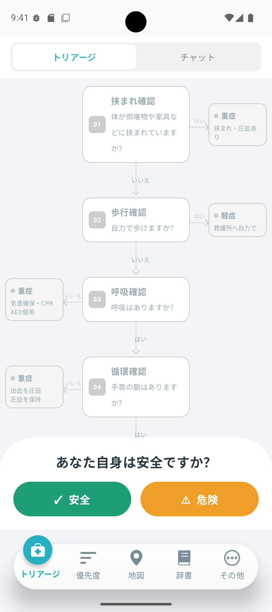
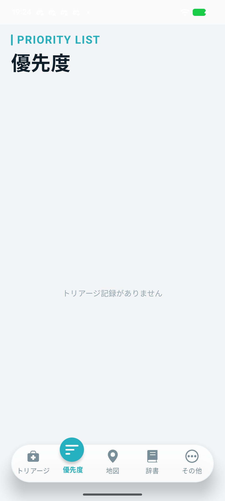
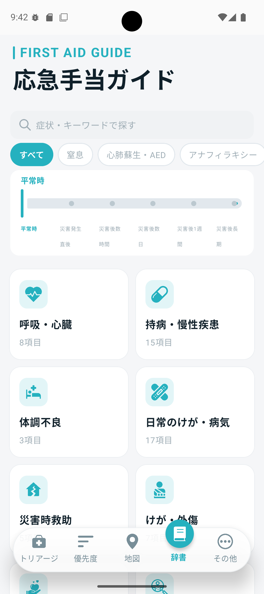
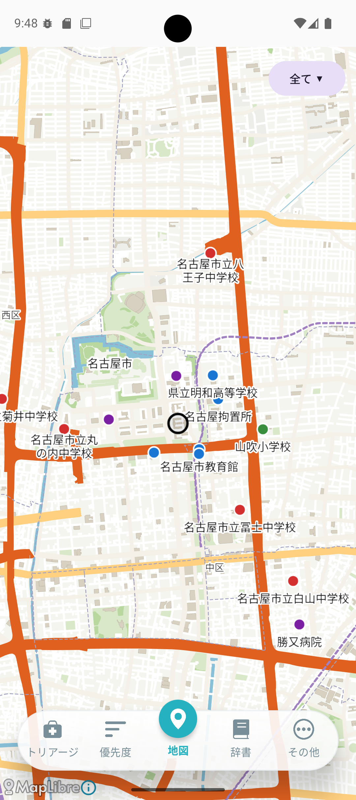
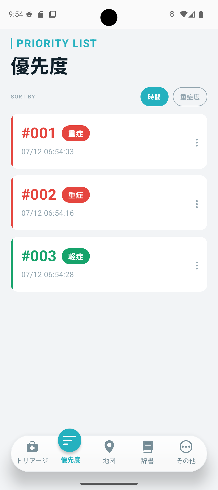
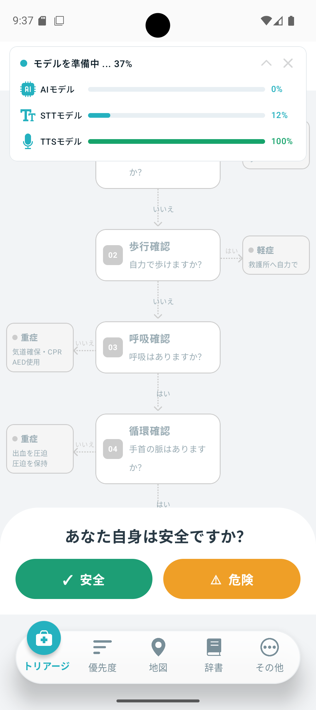

# 「Urg(アージ)」
<br>

## 目次

- [背景・課題](#背景課題)
- [システム概要](#システム概要)
- [環境構築](#環境構築)
- [「Urg(アージ)」の使い方](#urgアージの使い方)
- [使用しているアセットについて](#使用しているアセットについて)

<br>

## 背景・課題

災害発生直後は、救急隊や医療従事者などがすぐに到着できない場合があります。  
その間、一般市民は自身や周囲の被災者の状態を確認し、安全を確保しながら行動する必要があります。

しかし、災害直後は混乱しやすく、何を確認し、どのような順番で行動すべきかを判断することは簡単ではありません。  
さらに、通信障害によりインターネットが利用できない状況も想定されます。

本システムは、このような状況でも完全オフラインで市民トリアージや行動案内を行い、専門家が到着するまでの空白時間を支援することを目的としています。

<br>

## システム概要

このシステムは災害発生時に一般市民が自身や周囲の被災者の状態を確認し、市民トリアージや次にすべき行動案内を受けられることを目的とした災害支援アプリケーションです。

地震などの災害発生直後、専門家が到着するまでの空白時間において、ユーザーが落ち着いて状況を確認し、適切な行動をとれるよう支援します。

また、本システムは災害時に通信環境が利用できない状況を想定し、主要機能が完全オフラインで動作するよう設計しています。  

LLM による行動案内、音声入力、応急対応知識の検索などを端末内で処理することで、インターネット接続がない環境でも利用できることを目指しています。

<br>

## 環境構築

本システムを開発・実行するための環境構築手順を示します。

### 前提環境

以下の環境を準備してください。

| 項目 | 内容 |
|:---|:---|
| 開発 OS | Windows 10 / 11、macOS Sequoia 15.7.2 |
| IDE | Android Studio |
| Gradle JDK | Android Studio 同梱 JDK / JetBrains Runtime 21.0.10 |
| Java 互換バージョン | Java 11 |
| Kotlin | 2.3.21 |
| Android Gradle Plugin | 8.13.2 |
| Compose Multiplatform | 1.10.3 |
| Android compileSdk | 36 |
| Android minSdk | 24 |
| Android targetSdk | 36 |
| 対応 Android バージョン | Android 7.0 以降 |
| NDK | 27.0.12077973 |
| 実行環境 | Android エミュレーター、または Android 実機 |
| その他 | Git |

※ Gradle はプロジェクトに含まれる Gradle Wrapper を使用するため、別途インストールする必要はありません。

※ 現時点では Android 版を主な動作対象としています。

---

### リポジトリの取得

以下のコマンドでリポジトリを取得します。

```bash
git clone https://github.com/IndustryAcademiaCollaboration/urg.git
```

取得後、プロジェクトのディレクトリへ移動します。

```bash
cd urg
```

---

### Android Studio で開く

1. Android Studio を起動します。
2. `Open` を選択します。
3. 取得した `urg` フォルダを選択します。
4. Gradle Sync が自動で開始されるため、完了するまで待機します。

Gradle Sync 中に Android SDK の不足が表示された場合は、Android Studio の案内に従って必要な SDK をインストールしてください。

---

### アセットの確認

本システムでは、LLM、STT、TTS、地図データ、応急対応知識データなどのアセットを使用します。

アセットは主に以下の場所に配置します。

```text
composeApp/src/androidMain/assets/
```

主なアセットは以下の通りです。

```text
composeApp/src/androidMain/assets/
├── knowledge/
├── models/
├── piper.tsukuyomi/
├── sherpa-onnx-zipformer-ja-reazonspeech-2024-08-01/
├── open_jtalk_dic/
└── *.csv
```

モデルファイルや地図関連データが不足している場合、以下の機能が正常に動作しない可能性があります。

- LLM による行動案内生成
- 音声入力による文字起こし
- 音声案内機能
- 地図表示機能
- 応急対応知識の検索

---

### ビルド・実行

Android Studio 上で以下の手順を行います。

1. 実行する端末を選択します。
    - Android エミュレーター
    - Android 実機
2. 画面上部の実行ボタンをクリックします。
3. アプリがビルドされ、選択した端末で起動します。

コマンドでビルドする場合は、以下を実行します。

```bash
./gradlew build
```

Windows の場合は以下を実行します。

```bash
gradlew.bat build
```

---

### 実機で実行する場合

Android 実機で実行する場合は、以下を確認してください。

1. Android 端末の開発者向けオプションを有効にします。
2. USB デバッグを有効にします。
3. PC と Android 端末を USB 接続します。
4. Android Studio の実行端末一覧に端末が表示されていることを確認します。

端末が表示されない場合は、以下のコマンドで接続状況を確認できます。

```bash
adb devices
```

---

### 初回起動時について

本システムでは、初回起動時に必要なデータの読み込みや地図データの取得が行われます。

初回起動時は処理に時間がかかることがあるため、画面の案内に従ってしばらく待機してください。

---

### よくあるエラー

#### Gradle Sync に失敗する場合

以下を確認してください。

- インターネットに接続されているか
- Android Studio の SDK が正しくインストールされているか
- Gradle Sync を再実行して改善するか

#### モデルファイルが読み込めない場合

以下を確認してください。

- `composeApp/src/androidMain/assets/` 配下に必要なモデルファイルが配置されているか
- ファイル名がコード側の指定と一致しているか
- アセットの配置場所を変更していないか

#### 実機が認識されない場合

以下を確認してください。

- USB デバッグが有効になっているか
- USB ケーブルがデータ転送に対応しているか
- `adb devices` で端末が表示されるか

<br>

## 「Urg(アージ)」の使い方

<br>

### 基本的な流れ(市民トリアージ)

<p>
	
    
</p>

1. アプリを起動します。
2. 初回起動時は、必要なデータのセットアップが行われるため、完了するまで待機します。
3. 災害発生時は、画面下部の案内に従いボタンを入力していきます。
4. 全ての内容を入力後、入力内容に従ってAIが結果を出力します。
5. 出力結果に応じて行動を開始してください。
6. もしわからない状況になったら、画面上部のチャットに切り替え、音声入力/チャットにて質問をしてください。<br><br>

主な確認項目は以下の通りです。

| 項目    | 内容                     |
|:------|:-----------------------|
| 安全確認  | その場が安全かどうか確認します        |
| 挟まれ確認 | 倒壊物などに体が挟まれていないかを確認します |
| 歩行確認  | 自力で歩けるかを確認します          |
| 呼吸確認  | 呼吸しているかを確認します          |
| 循環確認  | 手首の脈があるかを確認します         |
| 意識確認  | 呼びかけに反応があるかを確認します      |


<br>

### 基本的な流れ(応急対応・辞書機能)

<p>
	
</p>


応急対応(辞書)機能画面では、災害時の状態やけがに関する情報を確認することができます。

1. ホーム画面下部にて辞書をクリックします。
2. 画面上部の検索欄にて単語を入力もしくは、スライドにて現在の状況に応じてスライドをしていくことで、絞り込みをすることができます。
3. 項目をクリックすることで調べたい記事を見ることができます。<br><br>

### 基本的な流れ(地図機能)

<p>
	
</p>

地図機能では、今いる地点から最寄りの病院、避難所、救護所を確認することができます。

1. ホーム画面下部にて地図をクリックします。
2. 画面に地図が表示され、自分の位置や病院、避難所、救護所を確認することができます。
3. スワイプをすることで、画面の移動や拡大縮小を行うことができます。
4. 画面右上の「すべて」をクリックすると、表示する施設種別を切り替えることができます。<br>

表示されている施設名
- 指定避難所
- 指定緊急避難場所
- 救護所
- 病院
<br><br>
### 基本的な流れ(優先度機能)

<p>
	
</p>

優先度機能では、トリアージ機能にてトリアージした人物の情報を編集、確認することができます。

前提として[基本的な流れ(市民トリアージ)](#基本的な流れ市民トリアージ)を参考に既に市民トリアージをしているものとします。

1. ホーム画面下部にて優先度をクリックします。
2. 画面に市民トリアージをした人物と日付が記載された項目が表示されいつ市民トリアージを行ったか確認することができます。
3. 項目に右側の":"をクリックすることで、編集や削除が行えます。
4. 項目をクリックすることで地図画面に遷移し、その人物に対して市民トリアージを行った場所を確認することができます。<br>

地図画面の使い方は[地図機能](#基本的な流れ地図機能)を参考にしてください。
<br><br>

## 使用しているアセットについて

本システムでは、アプリの動作に必要なデータやモデルファイルをアセットとして管理しています。

主なアセットは以下の通りです。

| 種類         | 内容                      | 用途                  | リポジトリ内への含有 |
|:-----------|:------------------------|:--------------------|:-----------|
| 応急対応知識データ  | 応急対応・災害対応に関する JSON ファイル | 応急対応情報の表示、検索、タグ絞り込み | 含める        |
| LLM モデル    | 端末内で行動案内を生成するためのモデルファイル | 市民トリアージ後の行動案内生成     | 原則含めない     |
| STT モデル    | 音声入力を文字起こしするためのモデルファイル  | 音声入力機能              | 原則含めない     |
| TTS 関連ファイル | 音声案内に使用するファイル　          | 　案内文の読み上げ           | 原則含めない     |
| 地図データ      | 避難所・地図表示に関するデータ　        | 　地図画面、避難所表示　        | 原則含めない     |
| 画像・アイコン    | README やアプリ内で使用する画像     | 画面説明、UI 表示          | 含める        |

リポジトリ内に含んでいないアセットは初回起動時に自動でインストールされます。

<p>
	
</p>

<br>配置場所

アセットは、用途ごとに以下のようなディレクトリで管理します。

````text
composeApp/src/androidMain/assets/
├── knowledge/
│   └── .json
├── models/
│   ├── config.json
│   ├── gemma3-1b-it-int4.task
│   ├── multilingual-e5-small-int8.onnx
│   ├── special_tokens_map.json
│   ├── tokenizer.json
│   └── tokenizer_config.json
├── piper.tsukuyomi/
│   ├── config.json
│   └── tsukuyomi-chan-6lang-fp16.onnx
├── sherpa-onnx-zipformer-ja-reazonspeech-2024-08-01/
│   ├── decoder-epoch-99-avg-1.onnx
│   ├── encoder-epoch-99-avg-1.int8.onnx
│   ├── joiner-epoch-99-avg-1.int8.onnx
│   └── tokens.txt
├── open_jtalk_dic/
├── aiti_Designated_emergency_shelter.csv
├── aiti_designated_evacuation_cneter.csv
├── hospital.csv
├── loolups.dat
├── trekking.brf
└── First-aidsttation.csv
````
<br>

### 応急対応知識データ(knowledge)について

応急対応や災害対応に関する情報は JSON 形式で管理しています。

JSON データには、主に以下の項目を含めます。

| 項目    | 内容                     |
|:------|:-----------------------|
|title | 表示するタイトル |
|category | 大分類 |
|subcategory | 小分類 |
|tags | 災害フェーズや状態を表すタグ |
|content | ユーザーに表示する本文 |

例：

```json
{
  "title": "出血時の対応",
  "category": "応急処置",
  "subcategory": "出血",
  "tags": [
  "平常時",
  "災害発生直後",
  "災害後数時間"
  ],
  "content": "出血している箇所を清潔な布などで圧迫します。"
}
```
<br>

### モデルファイルについて

本システムでは、LLM、STT、TTS の各機能でモデルファイルを使用しています。

モデルファイルは主に以下のディレクトリに配置しています。

```text
composeApp/src/androidMain/assets/models/
composeApp/src/androidMain/assets/sherpa-onnx-zipformer-ja-reazonspeech-2024-08-01/
composeApp/src/androidMain/assets/piper.tsukuyomi/
composeApp/src/androidMain/assets/open_jtalk_dic/
```

モデルファイルが配置されていない場合、以下の機能は正常に動作しない可能性があります。

- LLM による行動案内生成
- 音声入力による文字起こし
- 音声案内機能
- 応急対応知識の検索

<br>

### 地図ファイルについて

アプリケーションを開き該当の画面に遷移すると、自動でダウンロードが始まり地図データの取得が進みます。

androidMain内のcsvファイルは地図内の病院、救護所等のデータが格納されています。

<br>

## 注意事項

本システムは、災害時の一般市民向け支援を目的としたアプリケーションです。  
医師や救急隊員による診断・治療を代替するものではありません。

実際の災害現場では、周囲の安全を最優先し、可能な場合は救急隊や専門機関の指示に従ってください。