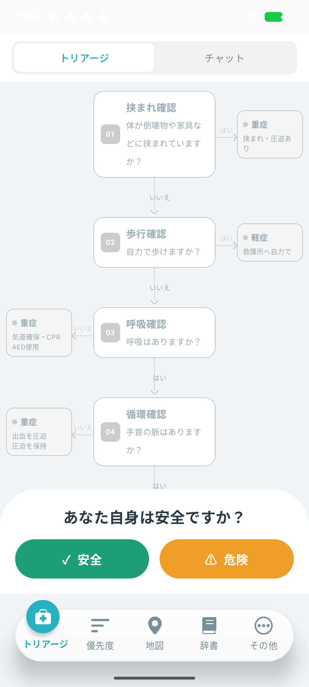
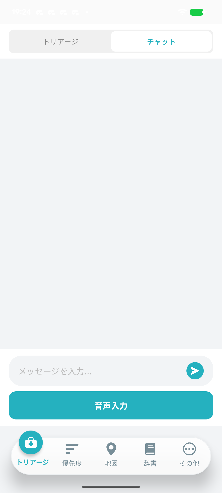
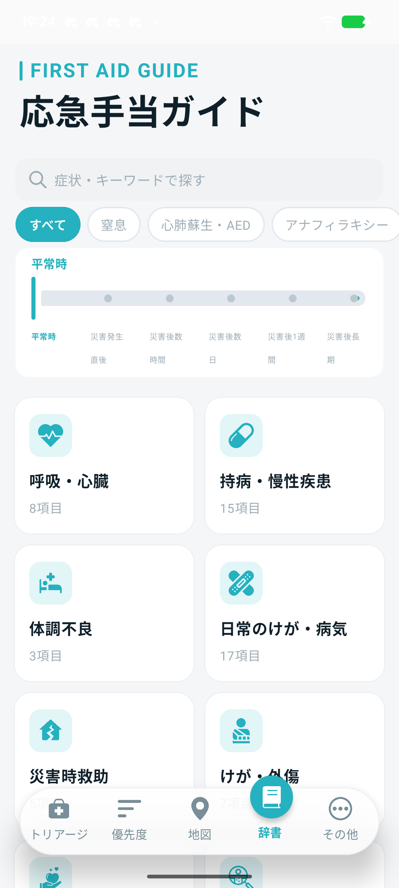
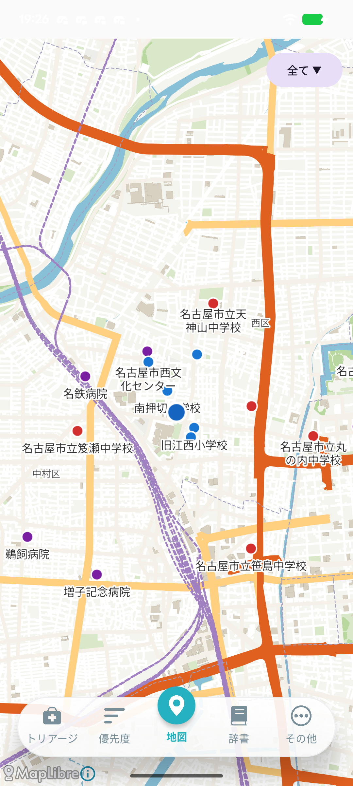

# 「Urg(アージ)」
<br>

## 目次

- [システム概要](#システム概要)
- [「Urg(アージ)」の使い方](#urgアージの使い方)
- [使用しているアセットについて](#使用しているアセットについて)

<br>

## システム概要

このシステムは災害発生時に一般市民が自身や周囲の被災者の状態を確認し、市民トリアージや次にすべき行動案内を受けられることを目的とした災害支援アプリケーションです。

地震などの災害発生直後、専門家が到着するまでの空白時間において、ユーザーが落ち着いて状況を確認し、適切な行動をとれるよう支援します。

<br>

## 「Urg(アージ)」の使い方

<br>

### 基本的な流れ(市民トリアージ)

<p>
	
	
<p>

1. アプリを起動します。
2. 起動後、初回インストールが始まるためインストール終了まで待機します。
3. 災害被災後、画面下部の案内に従いボタンを入力していきます。
4. 全ての内容を入力後、入力内容に従ってAIが結果を出力します。
5. 出力結果に応じて行動を開始してください。
6. もしわからない状況になったら、画面上部のチャットに切り替え、音声入力/チャットにて質問をしてください。<br><br>

主な確認項目は以下の通りです。

| 項目    | 内容                     |
|:------|:-----------------------|
| 安全確認  | その場が安全かどうか確認します        |
| 挟まれ確認 | 倒壊物などに体が挟まれていないかを確認します |
| 歩行確認  | 自力で歩けるかを確認します          |
| 呼吸確認  | 呼吸しているかを確認します          |
| 循環確認  | 手首の脈があるかを確認します         |
| 意識確認  | 呼びかけに反応があるかを確認します      |


<br>

### 基本的な流れ(辞書機能)

<p>
	
<p>


辞書機能画面では、災害時の状態やけがに関する情報を確認することができます。

1. ホーム画面下部にて辞書をクリックします。
2. 画面上部の検索欄にて単語を入力もしくは、スライドにて現在の状況に応じてスライドをしていくことで、絞り込みをすることができます。
3. 項目をクリックすることで調べたい記事を見ることができます。<br><br>

### 基本的な流れ(地図機能)

<p>
	
<p>

地図機能では、今いる地点から最寄りの病院、避難所、救護所を確認することができます。

1. ホーム画面下部にて地図をクリックします。
2. 画面に地図が表示され、自分の位置や病院、避難所、救護所を確認することができます。
3. スワイプをすることで、画面の移動や拡大縮小を行うことができます。
4. 画面右上の全てのところをクリックすると、避難所や救護所だけを地図に表示することができます。<br>

表示されている施設名
- 指定避難所
- 指定緊急避難場所
- 救護所
- 病院
<br><br>
### 基本的な流れ(優先度機能)

<p>
	
<p>

優先度機能では、トリアージ機能にてトリアージした人物の情報を編集、確認することができます。

前提として[基本的な流れ(市民トリアージ)](#基本的な流れ市民トリアージ)を参考に既に市民トリアージをしているものとします。

1. ホーム画面下部にて優先度をクリックします。
2. 画面に市民トリアージをした人物と日付が記載された項目が表示されいつ市民トリアージを行ったか確認することができます。
3. 項目に右側の":"をクリックすることで、編集や削除が行えます。
4. 項目をクリックすることで地図画面に遷移し、その人物に対して市民トリアージを行った場所を確認することができます。<br>

地図画面の使い方は[地図機能](#基本的な流れ地図機能)を参考にしてください。
<br><br>

---
## 使用しているアセットについて

本システムでは、アプリの動作に必要なデータやモデルファイルをアセットとして管理しています。

主なアセットは以下の通りです。

| 種類 | 内容 | 用途 | リポジトリ内への含有 |
|:---|:---|:---|:-----------|
| 知識データ | 応急対応・災害対応に関する JSON ファイル | 応急対応情報の表示、検索、タグ絞り込み | 含める        |
| LLM モデル | 端末内で行動案内を生成するためのモデルファイル | 市民トリアージ後の行動案内生成 | 含める        |
| STT モデル | 音声入力を文字起こしするためのモデルファイル | 音声入力機能 | 原則含めない     |
| TTS 関連ファイル | 音声案内に使用するファイル	案内文の読み上げ | 必要に応じて管理 | 含める        |
| 地図データ | 避難所・地図表示に関するデータ	地図画面、避難所表示 | 容量により判断 | 含めない       |
| 画像・アイコン | README やアプリ内で使用する画像 | 画面説明、UI 表示 | 含める        |

<br>配置場所

アセットは、用途ごとに以下のようなディレクトリで管理します。

````text
composeApp/src/androidMain/assets/
├── knowledge/
│   └── .json
├── models/
│   ├── config.json
│   ├── gemma3-1b-it-int4.task
│   ├── multilingual-e5-small-int8.onnx
│   ├── special_tokens_map.json
│   ├── tokenizer.json
│   └── tokenizer_config.json
├── piper.tsukuyomi/
│   ├── config.json
│   └── tsukuyomi-chan-6lang-fp16.onnx
├── sherpa-onnx-zipformer-ja-reazonspeech-2024-08-01/
│   ├── decoder-epoch-99-avg-1.onnx
│   ├── encoder-epoch-99-avg-1.int8.onnx
│   ├── joiner-epoch-99-avg-1.int8.onnx
│   └── tokens.txt
├── open_jtalk_dic/
├── aiti_Designated_emergency_shelter.csv
├── aiti_designated_evacuation_cneter.csv
├── hospital.csv
├── loolups.dat
├── trekking.brf
└── First-aidsttation.csv
````
<br>

### 知識データ(knowledge)について

応急対応や災害対応に関する情報は JSON 形式で管理しています。

JSON データには、主に以下の項目を含めます。

| 項目    | 内容                     |
|:------|:-----------------------|
|title | 表示するタイトル |
|category | 大分類 |
|subcategory | 小分類 |
|tags | 災害フェーズや状態を表すタグ |
|content | ユーザーに表示する本文 |

例：

```json
{
  "title": "出血時の対応",
  "category": "応急処置",
  "subcategory": "出血",
  "tags": [
  "平常時",
  "災害発生直後",
  "災害後数時間"
  ],
  "content": "出血している箇所を清潔な布などで圧迫します。"
}
```
<br>

### モデルファイルについて

本システムでは、LLM、STT、TTS の各機能でモデルファイルを使用しています。

モデルファイルは主に以下のディレクトリに配置しています。

```text
composeApp/src/androidMain/assets/models/
composeApp/src/androidMain/assets/sherpa-onnx-zipformer-ja-reazonspeech-2024-08-01/
composeApp/src/androidMain/assets/piper.tsukuyomi/
composeApp/src/androidMain/assets/open_jtalk_dic/
```

モデルファイルが配置されていない場合、以下の機能は正常に動作しない可能性があります。<br><br>

### 地図ファイルについて

アプリケーションを開き該当の画面に遷移すると、自動でダウンロードが始まり地図データの取得が進みます。

androidMain内のcsvファイルは地図内の病院、救護所等のデータが格納されています。<br><br>